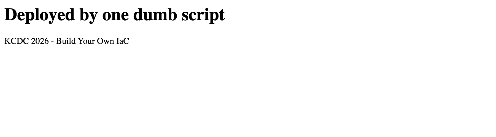
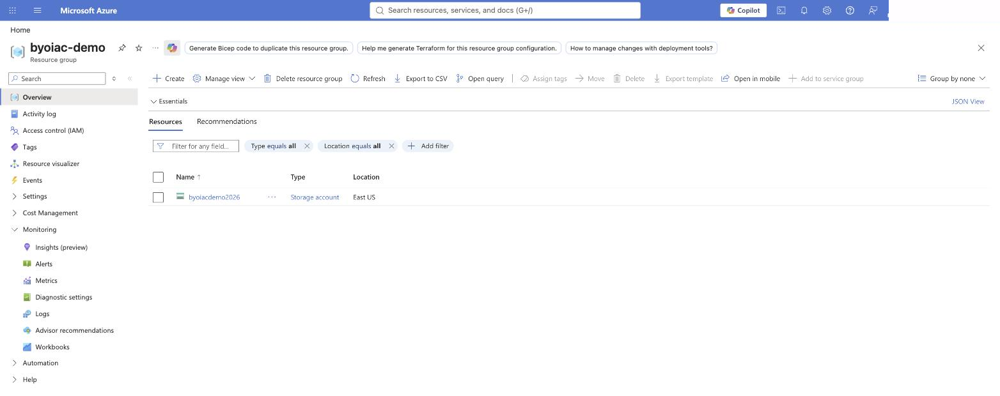

# Build Your Own IaC

## Demystifying the Magic

We are going to put a web page on the internet using ~~AWS~~ Azure. Then we will build a tool to help us.

<div class="abs-br m-6 text-sm opacity-60">KCDC 2026 · Adam Gordon Bell · Pulumi</div>

<!--
- 🗣 "We're going to put a web page on the internet in the next five minutes. Then we're going to spend the rest of the hour building the tool that should have done it — and by the end you'll know exactly how Terraform, Bicep and Pulumi work, because you'll have watched one get built."
- → Open cold; intro yourself _after_ the promise.
- ▶ pre-stage: `az login` · export sub id · `rm -f state.json state.lock` · run from repo root (`src/` folders)
-->

---
routeAlias: I_2
---

# I have a web page. It needs to be on the internet.

<Window title="https://…/files/hello.html" kind="editor">
<div style="background:#f7f7f2;color:#1a1a1a;padding:2.2rem 2.6rem;font-family:Georgia,serif;">
<div style="font-size:1.9rem;font-weight:700;margin-bottom:.6rem;">Deployed by one dumb script</div>
<div style="font-size:1.05rem;color:#444;">KCDC 2026 - Build Your Own IaC</div>
</div>
</Window>

<div class="mt-6 text-xl opacity-90">

Getting it there the hard way is how we learn what Terraform, Bicep and Pulumi actually do.

</div>

<!--
- 🗣 "Here's the whole problem: one HTML file, and it needs a URL. Every cloud tutorial on earth starts here. I could click through the portal for ten minutes — but I write software for a living, so I'm going to script it."
- → The page on screen is the exact page they'll watch go live in a few minutes — let that land on the second viewing, don't point it out now.
-->

---
routeAlias: I_2b
---

# Everything we're going to make

<div class="mt-6 rounded-lg border-2 border-blue-500 p-4">
  <div class="font-mono text-lg"><b>resource group</b> <span class="opacity-60">· byoiac-demo — the folder it all lives in</span></div>
  <div class="mt-3 rounded-lg border-2 border-blue-400 p-4">
    <div class="font-mono text-lg"><b>storage account</b> <span class="opacity-60">· byoiacdemo2026 — a globally-unique name</span></div>
    <div class="mt-3 rounded-lg border-2 border-blue-300 p-4">
      <div class="font-mono text-lg"><b>container</b> <span class="opacity-60">· files — a public bucket</span></div>
      <div class="mt-3 rounded-lg border-2 border-orange-500 p-4 bg-orange-500/10">
        <div class="font-mono text-lg"><b>hello.html</b> <span class="opacity-60">— the page, with a real URL</span></div>
      </div>
    </div>
  </div>
</div>

<!--
- 🗣 "Four objects, nested like folders. A resource group to hold everything, a storage account inside it, a public container inside that, and the file itself. That's the entire stack for this talk."
- → No clicks — the whole nest at once. Point at the orange one: everything else exists to give that file a URL.
- → Names matter later: the storage account name is globally unique (the matching problem), and this nesting IS the dependency graph Beat 4 discovers.
-->

---
routeAlias: I_3
---

# Start with scripting

<Window title="src/1-cli/deploy.sh" kind="editor">

```bash {all}{lines:true}
az group create --name byoiac-demo --location eastus --tags env=demo talk=kcdc

az storage account create --name byoiacdemo2026 --resource-group byoiac-demo \
  --location eastus --sku Standard_LRS --kind StorageV2 --allow-blob-public-access true

az storage container create --name files --account-name byoiacdemo2026 --public-access blob

echo '<h1>Deployed by one dumb script</h1><p>KCDC 2026 - Build Your Own IaC</p>' > hello.html
az storage blob upload --account-name byoiacdemo2026 --container-name files \
  --name hello.html --file hello.html --content-type text/html --overwrite

echo "https://byoiacdemo2026.blob.core.windows.net/files/hello.html"
```

</Window>

<div class="mt-4 text-xl">

**This is what you'd write.** Group, account, container, upload, print the URL.

</div>

<!--
- 🗣 (the scenario, said before this is on screen) "I have a web page. It needs to be on the internet. I could click through the Azure portal for ten minutes — but I'm smarter than that, so I script it."
- ⏱ 10 seconds. Do NOT read it aloud — everyone in the room has written this file.
- → Then the turn: every one of those commands is one HTTP request. Next slide.
-->

---
routeAlias: I_4
zoom: 0.82
---

# Let's remove the tool dependency

<Window title="src/2-api/deploy.py" kind="editor">

```py {1-10|12-19|21-29|31-33|35-39|41-49|51-60}{lines:true,maxHeight:'420px'}
import json, os, subprocess, time, urllib.request

SUB = os.environ["AZURE_SUBSCRIPTION_ID"]
ARM = "https://management.azure.com"
RG, ACCOUNT, CONTAINER, BLOB = "byoiac-demo", "byoiacdemo2026", "files", "hello.html"

# need a token — borrow az's, rather than rolling our own OAuth
TOKEN = subprocess.check_output(
    ["az", "account", "get-access-token", "--query", "accessToken", "-o", "tsv"],
    text=True).strip()

def call(method, url, body=None):
    print(f"{method} {url.split('?')[0]}")
    req = urllib.request.Request(url, method=method,
        data=json.dumps(body).encode() if body is not None else None,
        headers={"Authorization": "Bearer " + TOKEN, "Content-Type": "application/json"})
    with urllib.request.urlopen(req) as resp:
        print(f"  -> {resp.status}")
        return json.loads(resp.read() or b"null")

# 1. the resource group
call("PUT", f"{ARM}/subscriptions/{SUB}/resourcegroups/{RG}?api-version=2024-03-01",
     {"location": "eastus", "tags": {"env": "demo", "talk": "kcdc"}})

# 2. the storage account
call("PUT", f"{ARM}/subscriptions/{SUB}/resourceGroups/{RG}"
     f"/providers/Microsoft.Storage/storageAccounts/{ACCOUNT}?api-version=2023-05-01",
     {"location": "eastus", "sku": {"name": "Standard_LRS"}, "kind": "StorageV2",
      "tags": {"env": "demo"}, "properties": {"allowBlobPublicAccess": True}})

# storage takes a while. how long? ¯\_(ツ)_/¯ 20s is usually enough
print("sleeping 20s for the storage account...")
time.sleep(20)

# 3. the container — still ARM, just a deeper URL
call("PUT", f"{ARM}/subscriptions/{SUB}/resourceGroups/{RG}"
     f"/providers/Microsoft.Storage/storageAccounts/{ACCOUNT}"
     f"/blobServices/default/containers/{CONTAINER}?api-version=2023-05-01",
     {"properties": {"publicAccess": "Blob"}})

# 4. the file itself. blobs are the data plane: a different API, different auth,
#    so ask the management plane to sign us a SAS. still a PUT, though.
sas = call("POST", f"{ARM}/subscriptions/{SUB}/resourceGroups/{RG}"
           f"/providers/Microsoft.Storage/storageAccounts/{ACCOUNT}"
           f"/listServiceSas?api-version=2023-05-01",
           {"canonicalizedResource": f"/blob/{ACCOUNT}/{CONTAINER}",
            "signedResource": "c", "signedPermission": "rcwd", "signedProtocol": "https",
            "signedExpiry": time.strftime("%Y-%m-%dT%H:%M:%SZ",
                                          time.gmtime(time.time() + 3600))})["serviceSasToken"]

PAGE = "<h1>Deployed by one dumb script</h1><p>KCDC 2026 - Build Your Own IaC</p>"
blob_url = f"https://{ACCOUNT}.blob.core.windows.net/{CONTAINER}/{BLOB}"
print(f"PUT {blob_url}")
req = urllib.request.Request(f"{blob_url}?{sas}", method="PUT", data=PAGE.encode(),
    headers={"x-ms-version": "2021-08-06", "x-ms-blob-type": "BlockBlob",
             "Content-Type": "text/html"})
with urllib.request.urlopen(req) as resp:
    print(f"  -> {resp.status}")

print(f"\nyour page: {blob_url}")
```

</Window>

<!--
- 🗣 "No SDK. No framework. `import urllib`. A bearer token and four PUTs, top to bottom."
- 🗣 Name it PROACTIVELY on click 1 — the token line is right there: "`az` survives in exactly one place: logging in. It never touches a resource. Everything after this line is raw HTTP."
- → If pressed: Terraform's azurerm and Pulumi's azure-native default to Azure CLI auth locally too — delegating "who am I" to az is what the real tools do. Removing it = a ~6-line client-credentials POST + a service principal on stage; worse demo, same lesson. And auth is the first per-cloud knowledge we outsource — foreshadows the cliff (AWS SigV4, III_24).
- → Walk the clicks: constants → `call()` → the group → the account → the shrug of a sleep → the container → the file → print the URL.
- → (sleep) "Storage takes a while. How long? Twenty seconds is usually enough." Say the shrug out loud — Beat 4 cashes this cheque.
- → (blob) The container is still ARM, just a deeper URL. The file is the data plane: different API, different auth — but *still a PUT*, with a signature the management plane hands us.
- ⏱ ~2 min. Then run it.
-->

---
routeAlias: II_1
zoom: 0.86
---

# Run it

<Window title="zsh — byoiac" kind="terminal">

<div v-click="1">

```console
$ python src/2-api/deploy.py
```

</div>
<div v-click="2">

```console
PUT https://management.azure.com/subscriptions/<sub>/resourcegroups/byoiac-demo
  -> 201
PUT https://management.azure.com/subscriptions/<sub>/resourceGroups/byoiac-demo/providers/Microsoft.Storage/storageAccounts/byoiacdemo2026
  -> 202
```

</div>
<div v-click="3">

```console
sleeping 20s for the storage account...
```

</div>
<div v-click="4">

```console
PUT .../storageAccounts/byoiacdemo2026/blobServices/default/containers/files
  -> 201
POST .../storageAccounts/byoiacdemo2026/listServiceSas
  -> 200
PUT https://byoiacdemo2026.blob.core.windows.net/files/hello.html
  -> 201
```

</div>
<div v-click="5">

```console
your page: https://byoiacdemo2026.blob.core.windows.net/files/hello.html
```

</div>

</Window>

<!--
- → (slide only) the container and listServiceSas URLs are elided to `.../` so they fit; the live terminal prints them in full.
- ▶ RUN IT LIVE. ~26s wall clock; twenty of those are the sleep.
- ▶ Fill the sleep by walking the four PUTs still on the previous slide.
- ▶ THE PAYOFF — browser, not portal: open `https://byoiacdemo2026.blob.core.windows.net/files/hello.html`. A deployed web page in minute five. Public. Phones welcome.
- ⚠️ Right after a fresh account create the URL can 404 for a few seconds (blob DNS propagation) — narrate the last PUT while it settles.
- 🗣 "That's the whole job. So why does anybody need Terraform?"
-->

---
routeAlias: II_1b
---

# Minute five: it's real

<div class="grid grid-cols-2 gap-4 items-center">

<div>
<Window title="byoiacdemo2026.blob.core.windows.net/files/hello.html" kind="editor">

</Window>
<div class="text-center text-sm opacity-70 mt-1">what the world sees</div>
</div>

<div>
<Window title="portal.azure.com — byoiac-demo" kind="editor">

</Window>
<div class="text-center text-sm opacity-70 mt-1">what Azure now holds</div>
</div>

</div>

<!--
- → This slide is the still-image backup of the live moment: the page from I_2, now actually on the internet, and the portal showing what those four PUTs left behind.
- 🗣 "Same page from the first slide — except now it has a URL. And over in the portal: a resource group, a storage account, and inside it our container and our file. Four HTTP requests, four things in the cloud."
- → If the live browser demo worked, breeze past this in ~10s; it's here so the moment survives conference wifi.
-->

---
routeAlias: II_2
---

# Failure one — run it again

<Window title="zsh — byoiac" kind="terminal">

<div v-click="1">

```console
$ python src/2-api/deploy.py
PUT .../resourcegroups/byoiac-demo
  -> 200
PUT .../storageAccounts/byoiacdemo2026
  -> 200
```

</div>
<div v-click="2">

```console
sleeping 20s for the storage account...
```

</div>
<div v-click="3">

```console
PUT .../blobServices/default/containers/files
  -> 200
POST .../listServiceSas
  -> 200
PUT https://byoiacdemo2026.blob.core.windows.net/files/hello.html
  -> 201
```

</div>

</Window>

<div v-click="4" class="mt-4 text-xl">

It "worked" — 200s instead of 201s, because PUT is an upsert. Nothing broke.
It also re-sent everything and **sat there for twenty seconds** for a page that was already exactly right.

</div>

<!--
- ▶ RUN IT AGAIN LIVE. ~23s. Yes, all twenty of those seconds again.
- 🗣 "It worked. 200s instead of 201s — PUT is an upsert, so nothing broke."
- → Point at the blob's `201`: even that last line has no idea it just overwrote itself.
-->

---
routeAlias: II_2a
---

# By the way — we got lucky

<div class="grid grid-cols-2 gap-6 mt-2">

<div>

**Azure: one verb**

```python
# create OR update — same call, same URL
call("PUT", f"{ARM}/.../storageAccounts/{ACCOUNT}",
     {...})
```

<div class="text-lg mt-2 opacity-90">

ARM's PUT is an upsert. Rerunning was safe *by accident*.

</div>

</div>

<div v-click>

**AWS: pick the right verb**

```python
try:
    s3.create_bucket(Bucket=name)   # exists? error
except ClientError:
    pass                            # ...probably fine?
lambda_.create_function(...)        # exists? error
# vs update_function_configuration(...)
```

<div class="text-lg mt-2 opacity-90">

Create-X or Update-X — to pick one, you must first ask **what's out there**.

</div>

</div>

</div>

<div v-click class="mt-6 text-xl">

Check what exists, then decide what to send. **Hold that thought — we're about to do it on purpose.**

</div>

<!--
- 🗣 "Our rerun 'worked' for one reason only: Azure's PUT means create-or-update. On AWS half the APIs are Create-this / Update-that — different calls, different shapes. Your script has to look before it leaps, for every single resource."
- → The foreshadow is the whole point of the slide: read the cloud, compare, then act — that's the reconcile loop, showing up as a chore before we name it as a design.
- ⏱ ~60s. Cuttable if running long — the story survives without it.
-->

---
routeAlias: II_2b
zoom: 0.92
---

# Failure two — the page is no longer wanted

<Window title="src/2-api/deploy.py" kind="editor">

```diff
- # 3. the container — still ARM, just a deeper URL
- call("PUT", f"{ARM}/subscriptions/{SUB}/resourceGroups/{RG}"
-      f"/providers/Microsoft.Storage/storageAccounts/{ACCOUNT}"
-      f"/blobServices/default/containers/{CONTAINER}?api-version=2023-05-01",
-      {"properties": {"publicAccess": "Blob"}})
-
- print(f"PUT {blob_url}")
- req = urllib.request.Request(f"{blob_url}?{sas}", method="PUT", data=PAGE.encode(),
-     headers={"x-ms-version": "2021-08-06", "x-ms-blob-type": "BlockBlob",
-              "Content-Type": "text/html"})
- with urllib.request.urlopen(req) as resp:
-     print(f"  -> {resp.status}")
```

</Window>

<div v-click class="mt-4 text-xl">

Run it. The group and the account get PUT again. **The file is still sitting on the internet.**

</div>

<div v-click class="mt-3 text-xl">

Nothing happens — and *nothing can happen*. A script only ever says **make this exist**.
No line you could add means *get rid of what I asked for yesterday*.

</div>

<!--
- → Narrate this one; no need to run it. Delete the container and blob stanzas on screen.
- 🗣 "Nothing happens. And nothing *can* happen — a script only says 'make this exist'."
- ⏱ ~45 seconds. Don't hedge it, don't hint at the answer.
-->

---
routeAlias: II_2b2
---

# The obvious fix: a line for every delete

<Window title="src/2-api/deploy.py" kind="editor">

```diff
+ # container + page removed 2026-08-31 — keep these lines forever
+ call("DELETE", f"{ARM}/subscriptions/{SUB}/resourceGroups/{RG}"
+      f"/providers/Microsoft.Storage/storageAccounts/{ACCOUNT}"
+      f"/blobServices/default/containers/files?api-version=2023-05-01")
```

</Window>

<div v-click class="mt-4 text-xl">

It works — once. But removing something now means **adding** a line.

</div>

<div v-click class="mt-3 text-xl">

Six months in, the script is creates on top, a graveyard of deletes below —
re-deleting things that are long gone, every run. The script is a **log of actions**.
Nobody can read what the system *is*.

</div>

<!--
- 🗣 "Sure — I'll just add a DELETE line. It even works. But look at what my script became: to remove something I have to add a line, and I can never remove *that* line, because who knows which machines already ran it."
- → This is migrations-for-infrastructure: an append-only ledger of every decision ever reversed. The fix isn't a better log of actions — it's a picture of the goal, plus something that remembers what it did last time.
- ⏱ ~60s. Don't say "state" yet — the next slide asks the questions.
-->

---
routeAlias: II_2c
layout: center
class: text-center
---

# How do you do nothing when nothing changed?

# How do you delete?

<!--
- ⏱ Let both questions sit. They drive the rest of the hour.
- ▶ FIRE AND FORGET, right now, while this slide is up — the script's stack has to go before Beat 3:
  `az group delete -n byoiac-demo --no-wait --yes`
  `--no-wait` returns immediately; Azure finishes in ~60s in the background, which is about how long this slide and the next take.
- ⚠️ If Beat 3's first `up` returns 409, the delete is still in flight: wait ten seconds and run it again.
-->

---
routeAlias: II_2d
layout: center
---

# We have a working solution. It's missing one idea.

<div class="text-2xl mt-8 space-y-4">

<div v-click>What's already there? <span class="opacity-60">— then don't redo it.</span></div>

<div v-click>What's no longer wanted? <span class="opacity-60">— then get rid of it.</span></div>

<div v-click>Send <b>only the difference</b>.</div>

</div>

<div v-click class="mt-10 text-2xl">

That's a **diff**. The rest of this talk is making it explicit.

</div>

<!--
- 🗣 "Step back. The script works — it put a page on the internet. Everything wrong with it is the same missing idea: it never compares. What's already there? What's no longer wanted? Send only the difference."
- → Each failure maps to a line: the wasteful rerun is line 1, the impossible delete is line 2.
- 🗣 (last click) "That's a diff. The whole rest of this talk is making that diff explicit."
- → But a diff needs two sides you can actually compare — next two slides.
-->

---
routeAlias: II_5
zoom: 0.7
---

# The program becomes data

<Window title="infra.yaml" kind="editor">

```yaml {1-5|7-12|14-18|20-25}{lines:true}
resources:
  rg:
    type: Microsoft.Resources/resourceGroups
    name: byoiac-demo
    properties: {location: eastus, tags: {env: demo, talk: kcdc}}

  storage:
    type: Microsoft.Storage/storageAccounts
    name: byoiacdemo2026
    resourceGroup: byoiac-demo
    properties: {location: eastus, sku: {name: Standard_LRS},
                 kind: StorageV2, allowBlobPublicAccess: true}

  files:
    type: Microsoft.Storage/…/blobServices/containers
    name: files
    storageAccount: byoiacdemo2026
    properties: {publicAccess: Blob}

  hello:
    type: blob
    name: hello.html
    container: files
    properties: {contentType: text/html,
                 content: "<h1>Deployed by …</h1>"}
```

</Window>

<div v-click class="mt-3 text-xl">

**The script, with the verbs removed.** No PUT, no sleep, no order — just what should exist.

</div>

<!--
- 🗣 "First move: say what you want, as data. This is the same stack you watched deploy — the script with the verbs removed. No PUT, no sleep, no order. A picture of the goal, not a log of actions."
- → Recognition walk: four keys = the four PUTs. `hello`'s content is the page itself.
- → Trimmed to fit the slide — the real file (`src/3-state/infra.yaml`) is ~40 lines. It has no order idea in it at all — that's Beat 4's problem. Don't mention it.
- 🗣 "One dependency in the whole engine — a YAML parser. Parsing was never the interesting part."
- → Shaped like Pulumi YAML on purpose — the closing slide diffs against the real thing. Don't say so yet.
- → Handoff: "So half the diff is written down. The other half is out there in the cloud — and matching these names to those resources is the next problem."
-->

---
routeAlias: II_3
---

# The matching problem

<svg viewBox="0 0 900 470" class="w-full block" style="max-width:none; margin-top:-0.5rem">
  <!-- PROGRAM -->
  <g>
    <rect x="345" y="32" width="210" height="76" rx="10" class="dgbx" stroke="#3b82f6" stroke-width="2"/>
    <text x="450" y="62" text-anchor="middle" class="dgfg" style="font-size:21px;font-weight:600">Program</text>
    <text x="450" y="88" text-anchor="middle" class="dgmu" style="font-size:14px">what should exist — your names</text>
  </g>

  <!-- CLOUD -->
  <g>
    <rect x="645" y="312" width="210" height="76" rx="10" class="dgam" stroke="#f59e0b" stroke-width="2"/>
    <text x="750" y="342" text-anchor="middle" class="dgfg" style="font-size:21px;font-weight:600">Cloud</text>
    <text x="750" y="368" text-anchor="middle" class="dgmu" style="font-size:14px">what actually exists — its IDs</text>
  </g>

  <!-- 1. the question -->
  <g v-click="1">
    <line x1="500" y1="110" x2="683" y2="310" class="dgln" stroke-width="2.5" stroke-dasharray="7 7"/>
    <rect x="480" y="181" width="236" height="58" rx="8" class="dgbx2 dgbd"/>
    <text x="598" y="205" text-anchor="middle" class="dgfg" style="font-size:15px;font-weight:600">▲ which one is “files”?</text>
    <text x="598" y="227" text-anchor="middle" class="dgmu" style="font-size:13px;font-style:italic">the cloud doesn't keep your mapping</text>
  </g>

  <!-- 2. state as the recorded mapping -->
  <g v-click="2">
    <rect x="45" y="312" width="210" height="76" rx="10" class="dgbx" stroke="#3b82f6" stroke-width="2"/>
    <text x="150" y="342" text-anchor="middle" class="dgfg" style="font-size:21px;font-weight:600">State</text>
    <text x="150" y="368" text-anchor="middle" class="dgmu" style="font-size:14px">your name → the ID it gave back</text>
    <line x1="400" y1="110" x2="217" y2="310" stroke="#3b82f6" stroke-width="2.5"/>
    <rect x="201" y="181" width="212" height="58" rx="8" class="dgbx2 dgbd"/>
    <text x="307" y="205" text-anchor="middle" class="dgbb" style="font-size:15px;font-weight:600">■ you changed the code</text>
    <text x="307" y="227" text-anchor="middle" class="dgmu" style="font-size:13px">expected</text>
  </g>

  <!-- 3. drift -->
  <g v-click="3">
    <line x1="257" y1="350" x2="643" y2="350" stroke="#f59e0b" stroke-width="2.5"/>
    <rect x="344" y="321" width="212" height="58" rx="8" class="dgbx2 dgbd"/>
    <text x="450" y="345" text-anchor="middle" class="dgab" style="font-size:15px;font-weight:600">▲ someone else did</text>
    <text x="450" y="367" text-anchor="middle" class="dgmu" style="font-size:13px">unexpected</text>
  </g>

  <!-- 4. punchline -->
  <g v-click="4">
    <text x="450" y="440" text-anchor="middle" class="dgfg" style="font-size:17px">The diff is only computable on top of this mapping.</text>
    <text x="450" y="464" text-anchor="middle" class="dgmu" style="font-size:15px">State is memory of what you made — written down at create time.</text>
  </g>
</svg>

<!--
- ▶ Base: Program + Cloud only. Let them sit for a beat — the diff we just promised has to run between these two lists.
- 🗣 (click 1) "My program is a list of *my* names. The cloud is a list of *its* resources. To diff them, every line has to be matched to a real thing — and every leftover needs a verdict: mine-but-abandoned, or somebody else's. The cloud doesn't keep that mapping for me."
- 🗣 (click 2) "So we write it down ourselves, at the only moment we know it for sure — creation. The name I used, the ID Azure gave back. That table is state. It's not a clever trick; it's remembering your own actions."
- → Program↔State differ = you changed the code. Expected. Also answers the do-nothing question — you can only do nothing if you have something to compare against.
- 🗣 (click 3) "And this edge is the one nobody signs up for. Someone else changed it."
- ⏱ ~90 seconds. Don't explain drift yet — just name the edge, we come back to it.
- → (Q&A pocket — "why not tags?": tagging everything `managed-by: me` IS recording the mapping — memory stored in the cloud instead of next to the program; kubectl does a version of it with last-applied-configuration. Real answer: either way you're keeping a memory. A file wins on practicalities — not everything is taggable, "everything tagged mine" means enumerating the whole cloud, tags travel on clones, and you'll soon need to remember what you *sent* too, which is the cliff and drift later. Never claim tags can't work.)
- → (Q&A pocket, not a promise: `plan` is really a THREE-way merge, not a two-way diff — same reason kubectl invented last-applied-configuration.)
-->

---
routeAlias: II_4c
---

# The same picture, live

<IaCSandbox :stage="1" />

<!--
- ▶ LIVE. This toy is the DESTINATION — the loop working — and the next step of code builds it, memory first, then the loop. Program already says `rg` and `storage`. Hit `up`: `+ rg  + storage`, rows land in Cloud, then State.
- 🗣 "That triangle, running. Program says what should exist. The tool makes it. And then it writes down what it made — that's the third pane."
- ▶ Hit `up` AGAIN → `= rg  = storage — nothing sent`. Point at it.
- 🗣 "Nothing sent. Question one — and nobody wrote an if-statement per resource. It *generated* that, by comparing the program to the memory. The script re-sent everything and slept twenty seconds; this sent nothing."
- ▶ Now DELETE the `storage` lines from Program. `up` → `- storage  = rg` — the row disappears from Cloud and from State.
- 🗣 "And that's question two. I never wrote a delete line. I removed a wish, and the tool worked out the funeral — because the memory told it which row was its. The script could never do this."
- ▶ (optional) Edit `rg`'s tag → `~ rg`. Create, update, delete, skip — the whole vocabulary, one button. All of it gets built in the next step.
- 🗣 "One thing this toy doesn't have: any way to ask the cloud what's really there. No refresh button. Remember that."
- 🗣 "One button. This toy comes back twice more, with more buttons each time. Watch what it has by the end."
- 🗣 (handoff) "So that's where we're going. Now let's build it — it's smaller than you think."
- ⏱ 90 sec. Fallback if a live demo dies later: this needs no cloud and no wifi.
-->

---
routeAlias: II_4
---

# Step 3 — first, the memory

<Window title="src/3-state/engine.py" kind="editor">

```py {1-8|10-15}{lines:true}
STATE_FILE = "state.json"

# ---- pillar 1: state — what we THINK exists --------------------------------

def load_state():
    return json.load(open(STATE_FILE)) if os.path.exists(STATE_FILE) else {}

def save_state(state):
    json.dump(state, open(STATE_FILE, "w"), indent=2)

# ...and after every resource the loop touches, further down the file:

        call("PUT", url_for(res), res["properties"])
        state[key] = {"res": res, "saved": res["properties"]}
        save_state(state)
```

</Window>

<div v-click class="mt-4 text-xl">

The whole answer to "what's mine?" is **a JSON file the tool writes as it works.**

</div>

<!--
- 🗣 "We just tore the page down. Step 3 builds the tool that earns it back — same stack, but this time the tool remembers."
- → This is an excerpt of the ONE engine file — the same file stays on screen for the next slides. The memory is genuinely this small: two functions and a habit of writing down what you made, with the exact properties you sent. (The excerpt shows the ARM branch; the blob takes `blob_call` — the vocabulary slide covers it.)
- → PUT is safe, but it can only ever *add*. To delete something — or to notice something is missing — the tool has to remember what it made. That memory is `state.json`.
- → `saved` = what we sent. Sounds redundant today; the cliff cashes it.
-->

---
routeAlias: II_6
zoom: 0.8
---

# Step 3 — reconcile: compare, then act

<Window title="src/3-state/engine.py" kind="editor">

```py {1-6|8-19|9-13|14-19|13,19}{lines:true}
def diff(desired, state):
    creates = [k for k in desired if k not in state]
    deletes = [k for k in state if k not in desired]
    updates = [k for k in desired if k in state
               and desired[k]["properties"] != state[k]["saved"]]
    return creates, updates, deletes

def apply(desired, state, creates, updates, deletes):
    for key in deletes:
        print(f"  - {key}")
        call("DELETE", url_for(state[key]["res"]))
        del state[key]
        save_state(state)               # save as we go, so partial failure
    for key in creates + updates:       # leaves state matching reality
        res = desired[key]
        print(f"  {'+' if key in creates else '~'} {key}")
        call("PUT", url_for(res), res["properties"])
        state[key] = {"res": res, "saved": res["properties"]}
        save_state(state)
```

</Window>

<div v-click class="mt-3 text-xl">

Three set operations, and a loop that acts on them. **That is the entire content of every progress bar you have ever watched.**

</div>

<!--
- → This is the whole of step 3, one motion: `diff` decides, `apply` acts. The sandbox already showed you this loop running — here's all the code it took.
- → The yaml from earlier gets loaded here — one line, `yaml.safe_load` — and `DESIRED` stops being hardcoded. Say it in passing, don't show it.
- → Trimmed to fit: the real `apply` also branches for the blob (`blob_call` — the data plane) and keeps the script's `sleep(20)` shrug after the storage account. The loop shape is exactly this.
- → (click 1) Walk the three sets: in desired not state = create · in state not desired = delete · both-but-different = update.
- 🗣 "That is the entire content of every progress bar you have ever watched."
- → (apply clicks) Deletes first, then creates+updates; create and update are the same call — PUT is an upsert (the luck from the aside, now load-bearing). `plan` is just `diff` without `apply`.
- → (last click) `save_state` after _every_ resource: crash halfway → state matches reality, not intent. One line, real design decision.
-->

---
routeAlias: II_6b
zoom: 0.82
---

# Step 3 — the vocabulary

<Window title="src/3-state/engine.py" kind="editor">

```py {1-3|4-10}{lines:true}
def url_for(res):
    if res["type"] == "Microsoft.Resources/resourceGroups":
        return f"{BASE}/subscriptions/{SUB}/resourcegroups/{res['name']}?api-version=2024-03-01"
    if res["type"] == "Microsoft.Storage/storageAccounts/blobServices/containers":
        return (f"{BASE}/subscriptions/{SUB}/resourceGroups/{res['resourceGroup']}"
                f"/providers/Microsoft.Storage/storageAccounts/{res['storageAccount']}"
                f"/blobServices/default/containers/{res['name']}?api-version=2023-05-01")
    return (f"{BASE}/subscriptions/{SUB}/resourceGroups/{res['resourceGroup']}"
            f"/providers/{res['type']}/{res['name']}?api-version=2023-05-01")
```

</Window>

<div v-click class="mt-4 text-xl">

**The script's URLs, folded into one function.** This is the only type-specific code in the tool —
everything else is the loop.

</div>

<div v-click class="mt-3 text-xl opacity-90">

The blob keeps its data-plane detour (a SAS the management plane signs), and the script's
`sleep(20)` shrug lives on. All of deploy.py is in here now.

</div>

<!--
- 🗣 "The loop doesn't know what a storage account is. This function does — it's the script's four URLs, folded into one place. Everything type-specific in the whole tool is right here."
- → Blob branch: `blob_sas`/`blob_call`, same dance the script did — management plane signs, data plane PUTs. Don't teach SAS; name it and move on.
- → The `sleep(20)` after the storage account survives verbatim, shrug comment and all. It gets fixed in Beat 4 (`wait_ready`).
- → Foreshadow, lightly: "one function per URL shape" is a sentence today; it's the cliff later. Don't say "cliff".
-->

---
routeAlias: II_9
zoom: 0.78
---

# Step 3 — run it

<Window title="zsh — byoiac" kind="terminal">

<div v-click="1">

```console
$ python src/3-state/engine.py up
  + create rg
  + create storage
  + create files
  + create hello
  + rg
  + storage
  + files
  + hello
```

</div>
<div v-click="2">

```console
$ python src/3-state/engine.py up
  no changes.
```

</div>
<div v-click="3">

```console
$ cat state.json
{ "rg":      { "res": { ... }, "saved": { "location": "eastus", "tags": { ... } } },
  "storage": { "res": { ... }, "saved": { ... } },
  "files":   { "res": { ... }, "saved": { ... } },
  "hello":   { "res": { ... }, "saved": { "contentType": "text/html", ... } } }
```

</div>
<div v-click="4">

```console
$ # edit infra.yaml:  talk: kcdc  ->  talk: kcdc2026
$ python src/3-state/engine.py plan
  ~ update rg
$ python src/3-state/engine.py up
  ~ update rg
  ~ rg
```

</div>

</Window>

<div v-click="5" class="mt-3 text-lg">

Run two sent **nothing**. `plan` called **zero** write APIs — and `state.json` is a **belief**, not a fact: nothing was checked.

</div>

<!--
- ▶ RUN IT LIVE, in order. First `up`: the whole stack — the same four things the script made. **~26s measured** (2026-09-01): the gap after `+ storage` is the script's `sleep(20)` shrug, inherited verbatim. Narrate it: "twenty seconds of guessing — we fix that next beat."
- ⚠️ 409 on the first `up` = the Beat 2 `az group delete` is still in flight. Wait ten seconds and run it again.
- 🗣 (click 2) "Run it again. Nothing changed, so nothing happened, instantly — that's question one. The script re-sent everything and slept twenty seconds; this compared two dicts."
- 🗣 (click 3) "And there's the memory. state.json is a **belief**, not a fact — nothing was checked. Everything painful about IaC lives in the gap between the belief and the cloud." Plant it hard — the cliff and drift both cash this cheque.
- ▶ (click 4) Edit `talk: kcdc → kcdc2026` live, `plan` — one line, zero write APIs. Then `up` — same line, and now it's true. Plan and apply are the same subtraction; only one of them phones the cloud.
- ▶ PORTAL: Tags blade shows `kcdc2026`; revert + `up` again while talking.
- → No destroy here — the page stays up for the payoff (next slide); the real full-stack `destroy` happens at `II_10c`, as Beat 4's clean slate.
- ⚠️ All four transcripts are REAL captures (2026-09-01, one sitting, live against Azure): up 26.4s / instant no-changes / state shape verified / tag cycle `~ update rg` → `~ rg` confirmed in the portal-side tags. Tag lives in an inline dict (`tags: {env: demo, talk: kcdc}`) — edit in the editor, not with sed.
-->

---
routeAlias: II_9b
layout: center
class: text-center
---

# The page is back

<div class="text-2xl mt-6 opacity-90">

`https://byoiacdemo2026.blob.core.windows.net/files/hello.html`

</div>

<div v-click class="mt-10 text-xl">

The same page as minute five. This time it was deployed by a tool that **knows what it made** —
and can run twice, update in place, and take it away again.

</div>

<div v-click class="mt-8 text-xl opacity-80">

That was the promise at the top of the hour.

</div>

<!--
- ▶ THE PAYOFF — browser, not portal. Open the URL. Public, phones welcome.
- ⚠️ Right after a fresh account create the URL can 404 for a few seconds (blob DNS propagation) — narrate while it settles; verified 200 within ~2s on a warm account (2026-08-31).
- 🗣 "Same page. Different tool. This one knows what it made."
- ⏱ ~30 seconds — the Beat 2 promise landing. Let it land.
-->

---
routeAlias: II_10
layout: center
class: text-center
title: 114 lines
---

<div class="text-[10rem] leading-none font-bold">114</div>

<div class="text-3xl mt-4">lines of Python</div>

<div v-click class="mt-8 text-2xl opacity-90">

The script was fifty, and could deploy the page <em>once</em>.
These 114 deploy the same page — and can run twice, and take things away.

</div>

<div v-click class="mt-8 text-2xl opacity-90">

State. Diff. Reconcile. **That is a working IaC tool** — and now you know how all of them work.

</div>

<div v-click class="mt-8 text-xl opacity-70">

The rest of the hour is the part nobody puts on a slide.

</div>

<!--
- 🗣 "A hundred and fourteen lines. That is a working IaC tool — and now you know how all of them work."
- ⏱ PAUSE. Top of the first arc — let them enjoy it.
-->

---
routeAlias: II_10b
---

# Now it plans deletes and reruns

<IaCSandbox :stage="3" />

<!--
- 🗣 "Same toy from Step 3. It's grown a button, because our engine grew a verb."
- ▶ LIVE. Change a row's tag in Program → `plan` → `~ update`. Nothing moved: Cloud and State are untouched.
- 🗣 "That's the redo question answered. It knows what changed, so it can leave the rest alone."
- ▶ Delete a whole row out of Program → `plan` → `- delete`. Still nothing moved.
- ▶ `up` → it's really gone. Out of Cloud, out of State.
- 🗣 "That's the second question answered. The script never had a prayer at that one — it had no idea what it had made."
- ⏱ ~60 sec. Also a wifi fallback: no cloud needed.
-->

---
routeAlias: II_10b3
---

# Someone tidies the file

````md magic-move
```yaml
resources:
  rg:                 # the group
    type: Microsoft.Resources/resourceGroups
    ...
  storage:            # the account
    type: Microsoft.Storage/storageAccounts
    ...
  files:              # the container
    type: .../blobServices/containers
    ...
  hello:              # the page — the whole point
    type: blob
    ...
```
```yaml
resources:
  hello:              # the page — the whole point
    type: blob
    ...
  rg:                 # the group
    type: Microsoft.Resources/resourceGroups
    ...
  storage:            # the account
    type: Microsoft.Storage/storageAccounts
    ...
  files:              # the container
    type: .../blobServices/containers
    ...
```
````

<div class="mt-3 text-sm opacity-60 font-mono">src/3-state/infra-tidied.yaml</div>

<!--
- 🗣 "hello.html is the star of the file. Someone moves it to the top. Why not? The file is a picture, not a recipe — nothing about YAML says order means anything."
- ▶ CLICK — the block slides up. Say nothing while it moves.
- → This is the tidy that breaks step 3. The reordered file is checked in as `src/3-state/infra-tidied.yaml`; the next slide runs it.
-->

---
routeAlias: II_10c
zoom: 0.82
---

# Run it

<Window title="zsh — byoiac" kind="terminal">

<div v-click="1">

```console
$ python src/3-state/engine.py destroy
  - delete rg
  - delete storage
  - delete files
  - delete hello
  - hello
  - files
  - storage
  - rg
```

</div>
<div v-click="2">

```console
$ cp src/3-state/infra-tidied.yaml src/3-state/infra.yaml
$ python src/3-state/engine.py up
  + create hello
  + create rg
  + create storage
  + create files
```

</div>
<div v-click="3">

```console
  + hello
Traceback (most recent call last):
  ...
  File "src/3-state/engine.py", line 62, in blob_sas
    return out["serviceSasToken"]
TypeError: 'NoneType' object is not subscriptable
```

</div>

</Window>

<div v-click="4" class="mt-4 text-xl">

The tool created things in **file order** — and that won't scale.

</div>

<!--
- 🗣 (click 1) "Clean slate first — tear down Beat 3's stack."
- 🗣 (click 3) Savor the error: a blob PUT against a storage account that doesn't exist, and our code reports it as… NoneType is not subscriptable. The cloud said 404; the traceback names nothing. This is what shipping the luck feels like.
- 🗣 "Same disease as the script's line order; we just moved it into a prettier file. The order was real — it just lived nowhere."
- ⚠️ Both transcripts are REAL captures (2026-09-01, live against Azure). Note the destroy's apply lines run BACKWARDS (`- hello … - rg`): the engine tears down with `reversed(deletes)` — file-order deletes crashed for real (rg cascade killed the account before the blob delete could sign its SAS), so "teardown = setup order, backwards" is IN the engine. More borrowed luck; `II_12`'s reversed(ordered()) is what it grows into. Crash line 62 confirmed. The `up` from empty state creates nothing — no cleanup needed. Repro: `cp src/3-state/infra-tidied.yaml src/3-state/infra.yaml && python src/3-state/engine.py up`; restore with `git checkout src/3-state/infra.yaml`.
- → The fixed engine runs for real at `II_13`.
-->

---
routeAlias: II_10d
---

# A Go program couldn't have shipped this

<div class="grid grid-cols-2 gap-6 mt-4">

<div>

**Python** — dicts remember insertion order. Guaranteed, since 3.7.

```python
for key in resources:   # file order
    create(key)         # works. every run.
```

<div class="text-lg mt-2 opacity-90">

The bug is **invisible**. You ship it.

</div>

</div>

<div v-click>

**Go** — map order is randomized. *On purpose.*

```go
for name := range resources {  // shuffled
    create(name)               // every run
}
```

<div class="text-lg mt-2 opacity-90">

Fails loudly, differently, **the first afternoon.**

</div>

</div>

</div>

<div v-click class="mt-8 text-xl">

Go's designers randomized maps precisely so nobody could build on this luck.
The fix isn't a stricter language — it's **writing the order down.**

</div>

<!--
- 🗣 "Fun fact: this bug is a gift from Python. Dicts iterate in insertion order — guaranteed since 3.7 — so file order held, run after run. Go randomizes map iteration on purpose, precisely so you can't depend on it. Written in Go, this engine fails the first afternoon, a different way every run, and you fix it before it ever meets prod."
- → Terraform is written in Go. This is not a coincidence they were free to ignore.
- 🗣 (last click) "But the fix isn't a stricter language. The fix is writing the order down — which the script always knew, and the file threw away."
- ⏱ ~45s. Pure fun + one real point; cuttable if long, second in the trim order after II_2a.
-->

---
routeAlias: II_10e
---

# The whole problem, four names

<svg viewBox="0 0 900 210" class="w-full block" style="max-width:none; margin-top:1rem">
  <defs>
    <marker id="arr" markerWidth="8" markerHeight="8" refX="7" refY="4" orient="auto">
      <path d="M0,0 L8,4 L0,8 z" class="dglnf"/>
    </marker>
  </defs>
  <g>
    <rect x="40"  y="60" width="150" height="60" rx="9" class="dgbx" stroke="#3b82f6" stroke-width="2"/>
    <text x="115" y="97" text-anchor="middle" class="dgfg" style="font-size:20px;font-weight:600">rg</text>
    <rect x="270" y="60" width="150" height="60" rx="9" class="dgbx" stroke="#3b82f6" stroke-width="2"/>
    <text x="345" y="97" text-anchor="middle" class="dgfg" style="font-size:20px;font-weight:600">storage</text>
    <rect x="500" y="60" width="150" height="60" rx="9" class="dgbx" stroke="#3b82f6" stroke-width="2"/>
    <text x="575" y="97" text-anchor="middle" class="dgfg" style="font-size:20px;font-weight:600">files</text>
    <rect x="730" y="60" width="150" height="60" rx="9" class="dgbx" stroke="#3b82f6" stroke-width="2"/>
    <text x="805" y="97" text-anchor="middle" class="dgfg" style="font-size:20px;font-weight:600">hello</text>
    <line x1="270" y1="90" x2="196" y2="90" class="dgln" stroke-width="2.5" marker-end="url(#arr)"/>
    <line x1="500" y1="90" x2="426" y2="90" class="dgln" stroke-width="2.5" marker-end="url(#arr)"/>
    <line x1="730" y1="90" x2="656" y2="90" class="dgln" stroke-width="2.5" marker-end="url(#arr)"/>
    <text x="450" y="35" text-anchor="middle" class="dgmu" style="font-size:15px;font-style:italic">→ means "needs"</text>
  </g>
</svg>

<div class="mt-2 text-xl space-y-3">

<div v-click><span class="font-mono text-2xl">✗</span> <code>hello · rg · storage · files</code> <span class="opacity-60">— hello's parents don't exist yet. Crash.</span></div>

<div v-click><span class="font-mono text-2xl">✓</span> <code>rg · storage · files · hello</code> <span class="opacity-60">— every arrow satisfied.</span></div>

<div v-click class="text-2xl mt-6">

The arrows are the **truth**. An order is just something you can *derive* from them.
**So: store arrows. Derive order.**

</div>

</div>

<!--
- 🗣 "Strip everything away and the problem is four names and three arrows. An arrow means *needs*: the file needs the container, the container needs the account, the account needs the group."
- 🗣 (click 1) "The tidied file was this order. hello first — its parents don't exist. Crash."
- 🗣 (click 2) "This order works. So would any order where nothing runs before the things it points at."
- 🗣 (click 3) "That's the reframe the tools all make: stop storing an order, store the arrows. Order is derived, fresh, every run — and reversing the arrows gives you the teardown order for free."
- → Keep it abstract and fast — the real file with `dependsOn:` is the very next slide, and the eleven lines that do the deriving are two slides away.
- ⏱ ~45s.
-->

---
routeAlias: II_11
zoom: 0.78
---

# Step 4 — write the order down

<Window title="src/3-state → src/4-graph — infra.yaml" kind="editor">

````md magic-move {lines:true}

```yaml
resources:
  rg:
    name: byoiac-demo
    ...
  storage:
    name: byoiacdemo2026
    resourceGroup: byoiac-demo
    ...
  files:
    name: files
    storageAccount: byoiacdemo2026
    ...
  hello:
    name: hello.html
    container: files
    ...
```

```yaml
resources:
  rg:
    name: byoiac-demo
    ...
  storage:
    name: byoiacdemo2026
    resourceGroup: byoiac-demo
    dependsOn: [rg]             # Pulumi infers this from ${rg.name} — we can't
    ...
  files:
    name: files
    storageAccount: byoiacdemo2026
    dependsOn: [storage]
    ...
  hello:
    name: hello.html
    container: files
    dependsOn: [files]
    ...
```

````

</Window>

<div v-click class="mt-4 text-xl">

**`dependsOn:` is the thing the script already had.** It was the order of the lines.

</div>

<!--
- 🗣 "So we write it down. `dependsOn:` — storage needs the group, the container needs the account, the file needs the container."
- → Point at `dependsOn:` and say what it replaced: the script had this too, and it was the order of the lines. Group before account, account before container, container before file, because that's the order you have to do them in. That *was* a dependency graph — hardcoded, invisible, and correct only as long as nobody reordered the file. Now it survives any reordering — eleven lines of topological sort turn the constraints back into a safe order, in both directions (create parents-first, destroy children-first).
- 🗣 "Remember `dependsOn: [rg]` — that line disappears at the end of the talk."
-->

---
routeAlias: II_11b
zoom: 0.72
---

# Step 4 — and one of them isn't ARM at all

<Window title="src/4-graph/infra.yaml" kind="editor">

```yaml {1-8|10-21|11}{lines:true}
  files:
    type: Microsoft.Storage/storageAccounts/blobServices/containers
    name: files
    resourceGroup: byoiac-demo
    storageAccount: byoiacdemo2026
    dependsOn: [storage]
    properties:
      properties: {publicAccess: Blob}   # ARM nests container settings one level down

  hello:
    type: blob                  # not an ARM type: files live on the data plane
    name: hello.html
    resourceGroup: byoiac-demo
    storageAccount: byoiacdemo2026
    container: files
    dependsOn: [files]
    properties:
      contentType: text/html
      content: |
        <h1>Deployed by ~165 lines of Python</h1>
        <p>KCDC 2026 - Build Your Own IaC</p>
```

</Window>

<div v-click class="mt-2 text-xl">

The container is **still ARM** — just a deeper URL. The file is the **data plane**: a different
API, different auth, a SAS the management plane signs for us. Still a PUT, though.

</div>

<!--
- → Four resources now: rg → storage → container → the file itself.
- 🗣 (the page says ~165 — head off the "wasn't it 114?" murmur) "Step 3 was 114 lines. The graph and the poller make it 132, and by the end of the hour it's about 180 — that growth is the story of the rest of the talk."
- 🗣 (plant the flag) "Remember this edge — uniformity just ended, and it's going to matter."
- → `type: blob` is not an ARM type at all; that's the tell. `listServiceSas` is the management plane signing for the data plane.
- ⏱ ~45 seconds. Don't teach SAS — just name the seam.
-->

---
routeAlias: II_12
---

# Step 4 — walking the graph

<Window title="src/4-graph/engine.py" kind="editor">

```py {1-11|3-9|13-18|16}{lines:true}
def ordered(resources):  # depth-first topological sort
    done, order = set(), []
    def visit(key):
        if key not in done:
            done.add(key)
            for dep in resources[key].get("dependsOn", []):
                visit(dep)
            order.append(key)
    for key in resources:
        visit(key)
    return order

def wait_ready(res):  # 201/202 = "working on it" — poll until the cloud is done
    while True:
        code, actual = call("GET", url_for(res))
        if code != 404 and (actual or {}).get("properties", {}).get(
                "provisioningState") == "Succeeded":
            return
        time.sleep(2)
```

</Window>

<div v-click class="mt-4 text-xl">

Parents first on the way **up**. Children first on the way **down** — same list, reversed.

</div>

<div v-click class="mt-3 text-xl">

And `wait_ready` is what the script's `sleep(20)` grew up into. Same twenty seconds today —
but twenty seconds of **knowing**, and on a bad day it's forty and the tool still works.

</div>

<!--
- → Five lines of depth-first search = the whole "dependency graph" feature.
- → Walk it on the four names from the small example: `visit(hello)` → hello needs files → `visit(files)` → files needs storage → storage needs rg → rg has no deps, append it → unwind: storage, files, hello. Start anywhere in the dict — Go-map order, alphabetized, hello-first — the answer is the same. That's the point: order is *derived*, so nothing can scramble it.
- → 202 = "I've written down that you want this." The resource does not exist yet.
- 🗣 (callback) "Remember the `sleep(20)` in the script, with the shrug of a comment next to it saying twenty seconds is usually enough? This is what it turns into once you're not guessing: ask the resource whether it's ready, and go when it says yes."
- ⏱ THIS is the dead-air filler slide — come back here during the next slide's ~20s wait.
-->

---
routeAlias: II_13
---

# Step 4 — run it

<Window title="zsh — byoiac" kind="terminal">

<div v-click="1">

```console
$ rm -f state.json
$ python src/4-graph/engine.py up
```

</div>
<div v-click="2">

```console
  + create rg
  + create storage
  + create files
  + create hello
```

</div>
<div v-click="3">

```console
  + rg
```

</div>
<div v-click="4">

```console
  + storage
  + files
  + hello
```

</div>

</Window>

<div v-click="5" class="mt-6 text-xl">

**~21 seconds** between `+ rg` and `+ storage`. The storage account answered `202 Accepted`
and we polled until it was real. The container and the file land in the second after that.

</div>

<!--
- ⏱ ~20s of real dead air between `+ rg` and `+ storage`. ▶ Flip back one slide and walk `ordered()` and the poller; return when the shell prints.
- → The plan prints all four first, then the apply walks them parents-first.
- → Housekeeping: the `cp` at II_10c overwrote `src/3-state/infra.yaml` with the tidied file — after the talk, `git checkout src/3-state/infra.yaml`.
-->

---
routeAlias: II_13b
layout: center
class: text-center
---

# The page is back — and not by luck

<div class="text-2xl mt-6 opacity-90">

`https://byoiacdemo2026.blob.core.windows.net/files/hello.html`

</div>

<div v-click class="mt-10 text-xl">

The same page is back — but this time the order was **derived from the arrows**, not inherited
from the file — reordering the file can't touch it.

</div>

<div v-click class="mt-8 text-xl opacity-80">

Nothing can scramble it now.

</div>

<!--
- ▶ Browser, not portal. Open the URL. Public, phones welcome.
- ⚠️ Right after a fresh account create the URL can 404 for a few seconds (blob DNS propagation) — narrate the graph while it settles; verified 200 within ~2s on a warm account (2026-08-31).
- 🗣 "Same page. This time not by luck — the order came from the arrows, and nothing can scramble it."
- → The big promise-kept moment already landed at `II_9b` (Beat 3); this one is specifically the ordering victory.
- ⏱ ~20 seconds.
-->

---
routeAlias: II_14
---

# Step 4 — the measured cost of "creating…"

<div class="mt-4">

| | PUT returns | ready (`provisioningState: Succeeded`) |
|---|---|---|
| resource group | **201** in 1.2s | 1.4s |
| storage account | **202 Accepted** in 2.7s | **20.8s** |
| whole `up` | | **~21–23s** |

</div>

<div v-click class="mt-8 text-xl">

The API answered in under three seconds. The **resource** took twenty-one.
Every progress bar you have ever watched is a poller.

</div>

<!--
- 🗣 "The API answered in under three seconds. The resource took twenty-one. Every progress bar you've ever watched is a poller."
- → Real measurements — say the numbers out loud; if today's run drifted, say so.
-->

---
routeAlias: II_15
---

# Step 4 — and back down again

<Window title="zsh — byoiac" kind="terminal">

<div v-click="1">

```console
$ python src/4-graph/engine.py destroy
  - delete rg
  - delete storage
  - delete files
  - delete hello
```

</div>
<div v-click="2">

```console
  - hello
  - files
  - storage
  - rg
```

</div>

</Window>

<div v-click="3" class="mt-6 text-xl">

Look at the order. The plan lists `rg` first; the **apply** deletes `hello` first —
the file before its container, the container before its account.
Reverse topological order, for free, from the same five lines.

</div>

<!--
- → Point at the reversal: plan lists rg first, apply deletes storage first. Same five lines, reversed.
- ▶ `up` again NOW (restores state for Step 5) while talking.
-->

---
routeAlias: II_15b
layout: center
---

# You are here

<div class="text-xl leading-snug font-mono mt-2">

<div class="whitespace-nowrap"><span class="opacity-50 mr-5">1</span><b>cli</b><span class="opacity-60 ml-5">— a script driving a tool</span></div>
<div class="whitespace-nowrap"><span class="opacity-50 mr-5">2</span><b>api</b><span class="opacity-60 ml-5">— the same script, raw HTTP</span></div>
<div class="whitespace-nowrap"><span class="opacity-50 mr-5">3</span><b>state</b><span class="opacity-60 ml-5">— store the state, derive the diff</span></div>
<div class="whitespace-nowrap"><span class="opacity-50 mr-5">4</span><b>graph</b><span class="opacity-60 ml-5">— store the arrows, derive the order</span><span class="text-orange-500 font-bold ml-5">◀ you are here</span></div>
<div v-click class="opacity-35 whitespace-nowrap"><span class="mr-5">5</span>?</div>
<div v-click class="opacity-35 whitespace-nowrap"><span class="mr-5">6</span>?</div>
<div v-click class="opacity-35 whitespace-nowrap"><span class="mr-5">⋮</span></div>
<div v-click class="opacity-35 whitespace-nowrap"><span class="mr-5">N</span>?</div>

</div>

<!--
- 🗣 "Four steps in, we have a real tool: desired state, a diff, a graph. So — how much further is there?"
- ▶ click ×4: 5, 6, ⋮, N — let the unnamed rungs land in silence. Don't name them; the not-knowing IS the setup.
- → This is the breather before the turn. ~30 seconds, then the cliff.
-->

---
routeAlias: III_0
---

# What if something changes?

<IaCSandbox />

<!--
- 🗣 "You've watched this toy grow all hour. One button left — and it's there because of a question we haven't asked yet."
- ▶ LIVE. ✕ a row in Cloud — be the person who opens the portal. Hit `up` → **"no changes."** Let that sit.
- 🗣 "It's not lying. Program and State agree. Nobody asked the cloud. State is a belief — and a belief you never re-check is just a memory."
- ▶ `refresh` → the row drops out of State → `up` → it comes back.
- → Name the fork: two honest responses to drift — **undo it** (my yaml wins — what we just did) or **adopt it** (reality wins, pull it into state). Either way, step one is identical: ask the cloud what is actually there.
- ▶ `+ portal` — someone else creates `legacy-1`. `up` → **"no changes"** again. Blind to vanishing AND to arriving. (That unmanaged row is why `import` exists — notice there's no button for it.)
- 🗣 "So that's the whole next step. One GET per resource. How hard can that be?"
- ⏱ ~2 min. Also the wifi fallback: this needs no cloud. The engine doesn't have `refresh` yet — the toy is previewing the question; the code catches up over the next few slides.
-->

---
routeAlias: III_4
zoom: 0.72
---

# What we wrote — and what came back

<div class="grid grid-cols-[2fr_3fr] gap-4 items-start">
<div class="min-w-0">

<Window title="infra.yaml — storage" kind="editor">

```yaml
storage:
  type: Microsoft.Storage/storageAccounts
  properties:
    location: eastus
    sku: {name: Standard_LRS}
    kind: StorageV2
    tags: {env: demo}
    properties:
      allowBlobPublicAccess: true
```

</Window>

</div>
<div class="min-w-0">

<Window title="zsh — byoiac" kind="terminal">

```console
$ curl -H "Authorization: Bearer $TOKEN" \
    "https://management.azure.com/…/storageAccounts/byoiacdemo2026"
```

<div v-click="1">

```json
{
  "sku":  { "name": "Standard_LRS", "tier": "Standard" },
  "kind": "StorageV2",
  "location": "eastus",
  "tags": { "env": "demo" },
```

</div>
<div v-click="2">

```json
  "id": "/subscriptions/.../storageAccounts/byoiacdemo2026",
  "name": "byoiacdemo2026",
  "type": "Microsoft.Storage/storageAccounts",
```

</div>
<div v-click="3">

```json
  "properties": {
    "provisioningState": "Succeeded",
    "creationTime": "2026-08-13T16:05:05.2686429Z",
    "keyCreationTime": { "key1": "...", "key2": "..." },
    "primaryEndpoints": { "blob": "...", "dfs": "...", "file": "...",
                          "queue": "...", "table": "...", "web": "..." },
```

</div>
<div v-click="4">

```json
    "primaryLocation": "eastus",
    "statusOfPrimary": "available",
    "accessTier": "Hot",
    "minimumTlsVersion": "TLS1_0",
    "supportsHttpsTrafficOnly": true,
    "allowBlobPublicAccess": false,
    "allowCrossTenantReplication": false,
    "privateEndpointConnections": [],
    "networkAcls": { "defaultAction": "Allow", "bypass": "None", "ipRules": [] },
    "encryption": { "keySource": "Microsoft.Storage",
                    "services": { "blob": {}, "file": {} } }
  }
}
```

</div>

</Window>

</div>
</div>

<!--
- ⏱ THE TURN, ~minute 30. Slow down.
- 🗣 Say the caption, don't show it: "Left — our whole description. Right — one curl. The first block is ours; everything after is Azure's."
- 🗣 "Before we write any code — let's just ask. One curl, one GET, the same URL we PUT to."
- → NOT our engine — a raw curl. The point lands harder: the API itself answers like this; no tool made it complicated.
- ▶ Four clicks, each a chunk of the response: (1) the fields we sent — plus a `tier` we didn't; (2) identity Azure invented; (3) `properties` begins — timestamps, endpoints; (4) the rest of the wall. Read it slowly. The response _is_ the slide.
- → Fourteen keys under `properties`; we sent none of them.
- → Response lightly condensed to fit (endpoint URLs elided, `networkAcls` trimmed) — the shape and count are real; full capture in demo.md.
-->

---
routeAlias: III_3
---

# We sent 7. Azure answered with 48.

<div class="mt-4">

| | fields we **PUT** | fields the **GET** returns |
|---|---|---|
| resource group | 2 top-level (`location`, `tags`) · 4 keys total | 6 top-level · **9 keys total** |
| storage account | 5 top-level (`location`, `tags`, `sku`, `kind`, `properties`) · 7 keys total | 8 top-level · **48 keys total** |

</div>

<div v-click class="mt-8 text-xl">

A naive `desired != actual` diff would propose "fixing" **42 fields nobody asked for** —
several of which are read-only and will `400` if you try.

</div>

<!--
- 🗣 "We sent seven. Azure answered with forty-eight. An honest diff wants to 'fix' forty-two things you never mentioned — some read-only, they'd 400."
- → The 7 = the 5 top-level fields plus `sku.name` and the nested `allowBlobPublicAccess`.
- → If asked about the refresh run's "we own 4" (next slide): we *send* five, we *own* four — `allowBlobPublicAccess` is send-and-forget, not tracked. Owning less than you send is itself per-field knowledge.
- → Counts re-verified live 2026-09-01: SA 8 top-level / 48 total (14 under properties); RG 6 / 9. The table is exact.
-->

---
routeAlias: III_2
---

# Step 5 — ask the cloud what is actually there

<Window title="zsh — byoiac" kind="terminal">

<div v-click="1">

```console
$ python src/5-cliff/engine.py refresh
```

</div>
<div v-click="2">

```console
  = rg: cloud returned 6 top-level fields; we own 2
  = storage: cloud returned 8 top-level fields; we own 4
  = files: cloud returned 5 top-level fields; we own 1
  = hello: the data plane just answers with the bytes
```

</div>

</Window>

<div v-click="3" class="mt-6 text-xl">

`refresh` is one GET per resource. It is the moment the tool stops trusting its own memory —
and the moment it discovers the cloud has opinions.

</div>

<!--
- → refresh = one GET per resource; the tool stops trusting its memory.
- → "6 fields, 8 fields — sounds fine. It is not fine."
- → All four lines re-captured live 2026-09-01 (files: 5 top-level fields).
-->

---
routeAlias: III_5
---

# The fix — for exactly four resource types

<Window title="src/5-cliff/engine.py" kind="editor">

```py {1-6|8-9}{lines:true}
OWNED = {  # per resource type: the properties that are OURS to manage
    "Microsoft.Resources/resourceGroups": ["location", "tags"],
    "Microsoft.Storage/storageAccounts": ["location", "tags", "sku", "kind"],
    "Microsoft.Storage/storageAccounts/blobServices/containers": ["properties"],
    "blob": ["contentType", "content"],
}

def owned(res):  # our declared properties, minus anything not ours to manage
    return {k: v for k, v in res["properties"].items() if k in OWNED[res["type"]]}
```

</Window>

<div v-click class="mt-6 text-xl">

Six hand-written lines — for four resource types out of roughly **two thousand**.

</div>

<!--
- → Let the smallness do the work.
- 🗣 "Six lines. Hand-written. For four of roughly two thousand resource types. Then again for AWS."
- → And one of those four isn't even ARM — `blob` has its own two-field answer.
-->

---
routeAlias: III_6
---

# The second verse

<div class="text-xl mb-2">We sent this:</div>

```json
"sku": { "name": "Standard_LRS" }
```

<div class="text-xl mt-4 mb-2">Azure returned this:</div>

```json
"sku": { "name": "Standard_LRS", "tier": "Standard" }
```

<div v-click class="mt-6 text-xl">

`sku` is a field we **do** own — and it still comes back reshaped.
An allowlist of *field names* isn't enough. You have to compare **shape-wise**.

</div>

<div v-click>

<Window title="src/5-cliff/engine.py" kind="editor">

```py
def project(shape, actual):  # trim the cloud's answer to the shape we sent
    if isinstance(shape, dict) and isinstance(actual, dict):
        return {k: project(v, actual[k]) for k, v in shape.items() if k in actual}
    return actual                       # (sku comes back with a tier we never sent)
```

</Window>

</div>

<!--
- → Even a field we _own_ comes back reshaped; allowlist of names isn't enough — compare shape-wise.
- 🗣 "project() exists because of one property on one resource type."
- ⏱ 30 seconds, no more.
-->

---
routeAlias: III_7
layout: center
---

# Practical Problem

<div class="mt-8"></div>

## The loop was a hundred lines.

## The schemas are the millions.

<div v-click class="mt-10 text-xl opacity-90">

Which fields are mine · which are the server's · which are read-only · which come back reshaped

</div>

<div v-click class="mt-6 text-xl">

That knowledge is per-property, per-resource-type, across **~2,000 ARM types** — and then you do it all again for AWS.

</div>

<!--
- 🗣 (thesis, don't rush) "The loop was a hundred lines. The schemas are the millions. **That** is the product."
- → "A hundred" rounds the 114 from the line-count slide (`II_10`) — same number, cashed against the other side of the ledger. The engine has grown since (~180 by the end), but the loop is still that hundred-odd lines.
-->

---
routeAlias: III_9
---

# Step 6 — drift, done right

<Window title="src/6-drift/engine.py" kind="editor">

```py {4-7|8-10}{lines:true}
def refresh(state):
    for key in list(state):
        res = state[key]["res"]
        code, actual = call("GET", url_for(res))
        if code == 404:                 # deleted behind our back: forget it,
            print(f"  ! {key} vanished — deleted outside of us")
            del state[key]              # and the next plan will offer to rebuild
            continue
        was, now = state[key]["saved"], project(owned(res), actual)
        print(f"  {'~' if was != now else '='} {key}")
        state[key]["saved"] = now
```

</Window>

<!--
- → Two drifts, two answers: changed = compare & heal; vanished = forget, then rebuild.
- → Nothing runs here — walk the code; the edit fires on the next slide.
-->

---
routeAlias: III_9b
---

# Let's see how we handle edits

<Window title="zsh — not our tool" kind="terminal">

```console
$ az group update -n byoiac-demo --set tags.env=HACKED -o none
```

</Window>

<div v-click class="mt-8 text-2xl">

One tag, changed behind our back. **Our state file has no idea.**

</div>

<!--
- ▶ RUN IT, live — instant, no output. Same move a portal click makes; we just don't leave the terminal.
- 🗣 "Somebody — a coworker, a script, a well-meaning intern in the portal — changes a tag. Not through our tool."
- → Mirrors `III_11` on purpose: one line from outside, then plan/refresh/plan/up on the next slide.
-->

---
routeAlias: III_10
---

# Step 6a — changed

<Window title="zsh — byoiac" kind="terminal">

<div v-click="1">

```console
$ python src/6-drift/engine.py plan
  no changes.
```

</div>
<div v-click="2">

```console
$ python src/6-drift/engine.py refresh
  ~ rg
  = storage
  = files
  = hello
```

</div>
<div v-click="3">

```console
$ python src/6-drift/engine.py plan
  ~ update rg
```

</div>
<div v-click="4">

```console
$ python src/6-drift/engine.py up
  ~ update rg
  ~ rg
```

</div>

</Window>

<div v-click="5" class="mt-4 text-xl">

The first `plan` said **no changes** — because state is a *belief*, and nobody told it.

</div>

<!--
- → Step it: plan lies → refresh looks → plan tells the truth → up heals.
- 🗣 Callback: "state is a belief — and nobody told it."
- → The `up` already healed the tag — optionally show the portal Tags blade back at `env: demo` as proof, but don't drive the portal.
- → Whole sequence captured live 2026-09-01, drifted with the exact `az group update` line on `III_9b`. The heal is real: cloud tag came back `demo`.
-->

---
routeAlias: III_11
---

# Let's see how we handle deletes

<Window title="zsh — not our tool" kind="terminal">

```console
$ az group delete -n byoiac-demo --yes --no-wait
```

</Window>

<div v-click class="mt-8 text-2xl">

The whole stack. Gone. **Our state file has no idea.**

</div>

<!--
- ▶ RUN IT, live, right now — fire and forget, same trick as the Beat 2 teardown. ~60s in the background.
- 🗣 "Not the portal this time. I'm just going to delete... everything."
- ⏱ While it deletes: re-walk refresh()'s 404 branch or take a question. Never watch the spinner.
- → An RG with a storage account takes ~60s to die — the next slide's refresh needs it GONE, so buy the time here.
-->

---
routeAlias: III_12
zoom: 0.85
---

# Step 6b — run it

<Window title="zsh — byoiac" kind="terminal">

<div v-click="1">

```console
$ python src/6-drift/engine.py plan
  no changes.
```

</div>
<div v-click="2">

```console
$ python src/6-drift/engine.py refresh
  ! rg vanished — deleted outside of us
  ! storage vanished — deleted outside of us
  ! files vanished — deleted outside of us
  ! hello vanished — deleted outside of us
```

</div>
<div v-click="3">

```console
$ python src/6-drift/engine.py plan
  + create rg
  + create storage
  + create files
  + create hello
```

</div>
<div v-click="4">

```console
$ python src/6-drift/engine.py up      # ~23s — rebuilt from nothing
```

</div>

</Window>

<div v-click="5" class="mt-4 text-xl">

This beat is only possible **because of the cliff.** Without `OWNED`, every `refresh` would
scream drift on 42 fields nobody touched — and the one real change would be buried.

</div>

<!--
- 🗣 "This beat only works because of the cliff — without OWNED, 42 fields of noise would bury the one real change."
- ⏱ final `up` ≈ 23s — start it, advance to the sandbox slide and talk over it.
- ▶ END of live demo after this. Slides and the toy only from here.
-->

---
routeAlias: III_12c
layout: center
---

# You are here

<div class="text-xl leading-snug font-mono mt-2">

<div class="whitespace-nowrap"><span class="opacity-50 mr-5">1</span><b>cli</b><span class="opacity-60 ml-5">— a script driving a tool</span></div>
<div class="whitespace-nowrap"><span class="opacity-50 mr-5">2</span><b>api</b><span class="opacity-60 ml-5">— the same script, raw HTTP</span></div>
<div class="whitespace-nowrap"><span class="opacity-50 mr-5">3</span><b>state</b><span class="opacity-60 ml-5">— store the state, derive the diff</span></div>
<div class="whitespace-nowrap"><span class="opacity-50 mr-5">4</span><b>graph</b><span class="opacity-60 ml-5">— store the arrows, derive the order</span></div>
<div v-click class="whitespace-nowrap"><span class="opacity-50 mr-5">5</span><b>cliff</b><span class="opacity-60 ml-5">— know which fields are yours</span></div>
<div v-click class="whitespace-nowrap"><span class="opacity-50 mr-5">6</span><b>drift</b><span class="opacity-60 ml-5">— re-check the belief</span></div>
<div v-click class="whitespace-nowrap"><span class="opacity-35 mr-5">7</span><span class="opacity-35">?</span><span class="text-orange-500 font-bold ml-5">◀ you are here</span></div>
<div class="opacity-35 whitespace-nowrap"><span class="mr-5">⋮</span></div>
<div class="opacity-35 whitespace-nowrap"><span class="mr-5">N</span><span>?</span></div>

</div>

<!--
- 🗣 "Remember the blank rungs? We just cashed two of them." Click: 5 cliff, click: 6 drift.
- ▶ Click 3: the arrow lands on 7 — still unnamed. "The list did not get shorter. Here's the next one."
- → If riffing on what else is down there: parallel applies (the graph is also the go-fast plan — real engines run independent resources concurrently, in waves), blue/green switchovers, locking. We haven't even tried to go FAST yet.
- ⏱ ~20s, then straight into the one-word change.
-->

---
routeAlias: III_18
---

# Next problem

<div class="text-xl mb-4">Change one word in <code>infra.yaml</code>:</div>

<Window title="infra.yaml" kind="editor">

````md magic-move
```yaml
  storage:
    type: Microsoft.Storage/storageAccounts
    name: byoiacdemo2026
    properties:
      location: eastus
```
```yaml
  storage:
    type: Microsoft.Storage/storageAccounts
    name: byoiacdemo2026
    properties:
      location: westus2
```
````

</Window>

<div v-click class="mt-8 text-3xl">

What should `up` do?

</div>

<div v-click class="mt-8 text-xl">

You cannot move a storage account between regions. The "update" is secretly
**delete + create** — and that one word just deleted an account with all its blobs in it.

</div>

<!--
- ▶ ASK THE ROOM: "what should `up` do?" — actually pause. Only audience question in the deck.
- 🗣 "You can't move a storage account. The update is secretly delete + create — that one word just deleted an account with its blobs in it."
- → Which properties do this = per-property metadata = the cliff, third verse.
-->

---
routeAlias: III_18b
zoom: 0.9
---

# Replace, in place, or swap?

<div class="text-xl leading-relaxed mt-4">

One diff can be satisfied three different ways — and the tool has to pick:

</div>

<div class="text-xl leading-relaxed mt-6 space-y-4">

<div v-click><b>update in place</b> — PUT the change, the way our engine does. That works for a tag — but no PUT can move a region.</div>

<div v-click><b>delete, then create</b> — always works — and your storage account is <i>offline in between</i>.</div>

<div v-click><b>create, then switch</b> — build the new one, move traffic, delete the old. No downtime — but the name is taken, so the new one needs a <i>different name</i>.</div>

<div v-click><b>…and it cascades</b> — whatever depends on the replaced thing may have to rebuild too, in reverse dependency order.</div>

</div>

<div v-click class="mt-8 text-xl opacity-90">

Which move is legal, for which property, on which type — **per-property metadata again.**
Real tools store it in the schema and plan the whole dance for you.

</div>

<!--
- → No code for this one — we're in the listing-problems stage of the talk now.
- 🗣 Walk the three moves; the room has lived each one manually.
- → Q&A pocket: Terraform = `ForceNew` + `create_before_destroy`; Pulumi = `deleteBeforeReplace` + auto-naming (auto-naming is WHY create-first usually just works there).
- → The cascade line is the whole flurry slide compressed to a sentence.
-->

---
routeAlias: III_19
hide: true
layout: center
class: text-center
---

# Now make it worse

<div class="text-2xl mt-8 opacity-80">the storage account has a pinned name, so you cannot create the new one first</div>

<!--
- → Pinned name ⇒ can't create-first ⇒ delete first ⇒ every dependent goes too.
- ⏱ One breath — setup for the flurry.
-->

---
routeAlias: III_20
hide: true
---

# What the plan actually has to say

<Window title="pulumi preview" kind="terminal">

<div v-click="1">

```console
  ~ storage       replace  [location: eastus => westus2]
```

</div>
<div v-click="2">

```console
  - files         delete   (depends on storage)
```

</div>
<div v-click="3">

```console
  - hello         delete   (depends on files)
```

</div>
<div v-click="4">

```console
  - hello-2       delete   (depends on files)
```

</div>
<div v-click="5">

```console
  - storage       delete-before-replace
```

</div>
<div v-click="6">

```console
  + storage       create   westus2
```

</div>
<div v-click="7">

```console
  + container     create
```

</div>
<div v-click="8">

```console
  + hello         create
```

</div>
<div v-click="9">

```console
  + hello-2       create
```

</div>
<div v-click="10">

```console
  ! storage       pending delete — create failed, ghost lives in state
```

</div>

</Window>

<div v-click="11" class="mt-4 text-2xl">

**Pulumi computes this correctly every run — and you didn't even know it was a thing.**

</div>

<!--
- ▶ GO FAST — ~4s per click, zero explanation. It should feel like too much.
- 🗣 (landing) "Pulumi computes this correctly every run — and you didn't even know it was a thing."
- ⛔ Never reveal auto-naming. (Q&A pocket answer only.)
-->

---
routeAlias: III_21
hide: true
---

# Same picture. One edge.

<TriangleFocus focus="ps">

· which changes update, and which secretly **replace**

· unknown values — *known after apply*

· rename a variable without deleting the database

· one program, or twenty stacks referencing each other

</TriangleFocus>

<!--
- 🗣 "This edge — your code against what we remember. We wrote it as three list comprehensions."
- → Every line here is per-property or per-type knowledge. None of it is algorithm.
- ⏱ ~30s. Brisk. Do not explain any single item.
-->

---
routeAlias: III_22
hide: true
---

# Same picture. The other edge.

<TriangleFocus focus="sc">

· seven fields out, forty-eight back

· normalization — case, ordering, reshaped values

· *ready* is not *accepted* — polling, timeouts, per type

· soft-delete, purge, things that refuse to be deleted

· retries, throttling, eventual consistency

· **import** — adopt what we didn't create

</TriangleFocus>

<!--
- 🗣 "And this edge — what we remember against what's actually there. That was `refresh`. Twelve lines."
- → This is where the cliff lives; they've already felt it, so just name the family.
- ⏱ ~30s.
-->

---
routeAlias: III_23
hide: true
---

# Same picture. The file in the corner.

<TriangleFocus focus="state">

· secrets — outputs include passwords

· two engineers, one state file — that's why remote state and locking exist

· versioning, rollback, audit, recovery

· a format that still opens in three years

</TriangleFocus>

<div class="mt-6 text-xl">

The same diagram, the same three questions. **That is the 1% — and it is all of the work.**

</div>

<!--
- 🗣 "Same diagram all three times. The picture never got more complicated. The labels did."
- → The locking line is the whole race beat in one item. Q&A pocket (in `demo.md` Beat 7): two `up`s three seconds apart, both exit zero, and state ends up asserting resources Azure is mid-delete. the five-line `O_EXCL` fix is in `src/6-drift/engine.py`'s `main()` if anyone asks to see it.
- 🗣 (land) "That's the one percent. And it's all of the work."
- ⏱ ~30s, then straight into the close.
-->

---
routeAlias: III_24
zoom: 0.85
---

# What about the other clouds?

<div class="text-xl leading-relaxed mt-2">

Everything we built leaned on one mercy: **Azure is uniform.** One protocol, one auth, PUT everywhere.

</div>

<div class="text-xl leading-relaxed mt-6 space-y-4">

<div v-click><b>AWS</b> — three protocols before breakfast: per-service signing, different pagination, different error shapes — and IAM says "created" before it's true.</div>

<div v-click><b>GCP</b> — every create is a long-running operation to poll; projects and quotas are first-class citizens.</div>

<div v-click><b>Kubernetes</b> — the API is <i>already</i> desired-state… so now you're reconciling against another reconciler.</div>

<div v-click><b>All of them</b> — their own retry rules, throttling, IDs, naming rules. None of it transfers.</div>

</div>

<div v-click class="mt-8 text-xl opacity-90">

Someone has to eat this list — per cloud, per service, per property, kept current forever.
**That is what an IaC product actually is.**

</div>

<!--
- 🗣 (land) "Azure Native is generated from the same API specs we just called by hand. The product is the team that ate the whole list."
- → Generation buys coverage, not correctness — there's a patching layer. Pocket answer only.
-->

---
routeAlias: III_8
layout: center
---

# We built 99% of the *idea* —

<div class="mt-2 mb-8 text-base opacity-70">an afternoon well spent</div>

<div class="w-full max-w-3xl">

<div class="text-sm mb-2 opacity-80">how complete it <b>feels</b></div>
<div class="flex w-full h-12 rounded overflow-hidden text-sm font-bold">
  <div class="flex items-center justify-center" style="width: 96%; background: #3b82f6; color:#fff;">■ state · diff · reconcile · graph</div>
  <div class="flex items-center justify-center" style="width: 4%; background: #f59e0b; color:#fff;">▲</div>
</div>

<div v-click>

<div class="text-sm mt-8 mb-2 opacity-80">how the <b>work</b> is actually distributed</div>
<div class="flex w-full h-12 rounded overflow-hidden text-sm font-bold">
  <div class="flex items-center justify-center" style="width: 4%; background: #3b82f6; color:#fff;">■</div>
  <div class="flex items-center justify-center" style="width: 96%; background: #f59e0b; color:#fff;">▲ schemas × 2,000 types · replace rules · parallel applies · unknowns · retries · partial failure</div>
</div>

</div>

</div>

<div v-click class="mt-10 text-2xl">

**— and 1% of the work.**

</div>

<!--
- → Relief valve — same claim as a picture and a joke.
- 🗣 "We built 99% of the idea — and 1% of the work."
-->

---
routeAlias: IV_1
---

# So: use Pulumi

<div class="grid grid-cols-2 gap-4">

<div>

<div class="text-lg mb-1 opacity-70">ours — infra.yaml</div>

```yaml
resources:
  rg:
    type: Microsoft.Resources/resourceGroups
    name: byoiac-demo
    properties:
      location: eastus
      tags: {env: demo, talk: kcdc}

  storage:
    type: Microsoft.Storage/storageAccounts
    name: byoiacdemo2026
    resourceGroup: byoiac-demo
    dependsOn: [rg]
    properties:
      location: eastus
      sku: {name: Standard_LRS}
      kind: StorageV2
      tags: {env: demo}
```

</div>

<div>

<div class="text-lg mb-1 opacity-70">real Pulumi YAML</div>

```yaml
resources:
  rg:
    type: azure-native:resources:ResourceGroup
    properties:
      resourceGroupName: byoiac-demo
      location: eastus
      tags: {env: demo, talk: kcdc}

  storage:
    type: azure-native:storage:StorageAccount
    properties:
      accountName: byoiacdemo2026
      resourceGroupName: ${rg.name}

      location: eastus
      sku: {name: Standard_LRS}
      kind: StorageV2
      tags: {env: demo}
```

</div>

</div>

<div v-click class="mt-3 text-xl">

You **delete a line** when you graduate — `${rg.name}` *is* the edge, so `dependsOn` is gone.

</div>

<!--
- 🗣 Disclosure, with a grin: "I work at Pulumi, so of course I'd say this — but here's the whole pitch, one slide."
- 🗣 "Same shape as ours. Two differences: real type tokens backed by the schemas we couldn't write — and `dependsOn` is gone, because `${rg.name}` _is_ the edge. You delete a line when you graduate."
- → The ONE Pulumi slide (2026-09-01: III_24's provider line neutralized, C# slide hidden). Everything you'd want to add — generated providers, other languages, C# — say it here or in Q&A, don't slide it.
- → `${rg.name}` doubles as the unknown-values callback. Terraform is also a fine answer; the point is "use a real one."
-->

---
routeAlias: IV_3
hide: true
---

# State. Diff. Reconcile.

<div class="text-2xl mt-6 opacity-80">a hundred lines, and now you know how all of them work</div>

<div v-click class="text-2xl mt-10 opacity-80">everything after that is per-resource knowledge someone else already paid for</div>

<!--
- 🗣 "State. Diff. Reconcile. A hundred lines — everything after that is per-resource knowledge someone else already paid for."
- → End calm: relief, not fear. Two slides left: the invitation, then the QR.
-->

---
routeAlias: IV_3b
layout: center
---

# Build your own *everything*

<div class="text-xl leading-relaxed mt-4 space-y-4">

<div>Your own database. Your own file system. Your own shell. Your own IaC.</div>

<div v-click><b>The idea always fits in an afternoon.</b> That's the fun part — and the learning part.</div>

<div v-click><b>The cliff always comes.</b> The moment it explodes in complexity is the payoff: now you know exactly what the real one is <i>for</i> — and you can read it fluently.</div>

<div v-click><b>That's when you're allowed to stop.</b> Don't run it in production. Keep the understanding.</div>

</div>

<!--
- 🗣 "This works for everything. Build your own database. Your own file system. The idea fits in an afternoon; the cliff shows you what the real product is for; then stop — don't run it in production. Keep the understanding."
- → The invitation slide. This is the thing you want them to DO with the talk.
-->

---
routeAlias: IV_2
zoom: 0.78
---

# Exercise for the reader

<Window title="Program.cs" kind="editor">

```csharp
using Pulumi;
using Pulumi.AzureNative.Resources;
using Pulumi.AzureNative.Storage;
using Pulumi.AzureNative.Storage.Inputs;

return await Deployment.RunAsync(() =>
{
    var rg = new ResourceGroup("rg", new ResourceGroupArgs
    {
        ResourceGroupName = "byoiac-demo",
        Location = "eastus",
        Tags = { { "env", "demo" }, { "talk", "kcdc" } },
    });

    var storage = new StorageAccount("storage", new StorageAccountArgs
    {
        AccountName = "byoiacdemo2026",
        ResourceGroupName = rg.Name,
        Location = "eastus",
        Sku = new SkuArgs { Name = SkuName.Standard_LRS },
        Kind = Kind.StorageV2,
        Tags = { { "env", "demo" } },
    });
});
```

</Window>

<!--
- 🗣 "And the exercise for the reader: here's the same program in this room's language. Same desired state, same engine underneath — rg.Name is the same edge the YAML reference was."
- → Fun beat, not a pitch — languages are generated frontends over the same engine; YAML was just the simplest one.
-->

---
routeAlias: IV_4
layout: center
class: text-center
---

# Thanks!

<div class="flex items-start justify-center gap-16 mt-10">

<div class="text-center">
  
  <div class="text-xl font-bold">Adam Gordon Bell</div>
  <div class="text-base opacity-60">Pulumi</div>
  <div class="mt-2 text-sm opacity-70 space-y-1 text-left inline-block">
    <div class="flex items-center gap-2"><carbon-logo-x /> @adamgordonbell</div>
    <div class="flex items-center gap-2"><carbon-cloud /> @adamgordonbell.bsky.social</div>
  </div>
</div>

<div class="text-center">
  <div class="bg-white rounded-lg p-2 inline-block shadow-lg">
    
  </div>
  <div class="mt-2 text-base opacity-80">The code + this talk</div>
  <div class="text-sm opacity-50 font-mono">github.com/adamgordonbell/<br>build-your-own-iac</div>
</div>

<div class="text-center">
  <div class="bg-white rounded-lg p-2 inline-block shadow-lg">
    
  </div>
  <div class="mt-2 text-base opacity-80">My writing at Pulumi</div>
  <div class="text-sm opacity-50 font-mono">pulumi.com/blog/author/<br>adam-gordon-bell</div>
</div>

</div>

<!--
- → Leave this up through Q&A. Left QR = the repo (README walks every step); right QR = Pulumi author page (verified 200, 2026-09-01).
- ▶ After stage: `destroy`, rm state files. Repo went public 2026-09-01 — both QRs verified live.
-->
